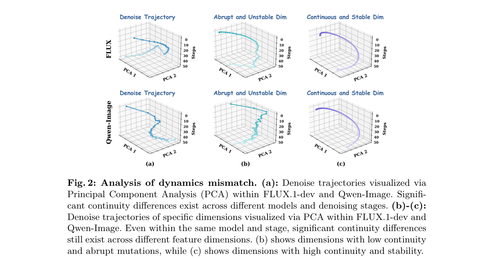

# LinCa

**Accelerating Diffusion Models via Learnable Decomposed Feature Caching**

[Paper](https://arxiv.org/abs/2608.17973) · [Code](https://github.com/QHR69/LinCa) · [Weights](https://huggingface.co/QHRQQQ/LinCa) · [中文说明](README_zh.md)

LinCa is a feature-caching accelerator for diffusion models. A lightweight invertible network decomposes cached features into sub-components with different continuity, applies a matching prediction order to each component, and reconstructs the original feature space. The mapping is strictly invertible, so reconstruction is lossless.

With **&lt;0.2%** extra parameters, LinCa keeps near-lossless quality at **5–7×** speedup. The teaser below is Qwen-Image with LinCa at **6.95×**.

<p align="center">
  
</p>

## Supported models

| Model | Code | Released weights | Notes |
|---|---|---|---|
| FLUX.1-dev | [`models/flux`](models/flux) | 3-stage predictors | Inference with released weights |
| Qwen-Image | [`models/qwen_image`](models/qwen_image) | two-stage checkpoint | Defaults match the released file |
| Qwen-Image-Edit | [`models/qwen_image_edit`](models/qwen_image_edit) | two-stage checkpoint | Defaults match the released file |
| HunyuanVideo | [`models/hunyuanvideo`](models/hunyuanvideo) | — | Train your own predictor |
| Wan2.1 | [`models/wan2.1`](models/wan2.1) | — | Train your own predictor |

Predictor weights live on Hugging Face: [QHRQQQ/LinCa](https://huggingface.co/QHRQQQ/LinCa). Backbone weights are **not** included; download them from the official FLUX / Qwen / HunyuanVideo / Wan sources.

## Quick start

Install the official stack for the backbone you want to run, then drop in the LinCa predictor.

### Qwen-Image

```bash
huggingface-cli download QHRQQQ/LinCa qwen-image_checkpoint.pt --local-dir ./checkpoints

cd models/qwen_image/qwen_image_linca_two_stage
python sample_learned.py \
  --checkpoint ../../../checkpoints/qwen-image_checkpoint.pt \
  --prompt_file prompts/DrawBench200.txt \
  --output_dir samples/qwen_image
```

### Qwen-Image-Edit

```bash
huggingface-cli download QHRQQQ/LinCa qwen-image-edit_checkpoint.pt --local-dir ./checkpoints

cd models/qwen_image_edit/qwen_image_edit_linca_two_stage
python sample_edit_single.py \
  --checkpoint ../../../checkpoints/qwen-image-edit_checkpoint.pt \
  --image path/to/input.png \
  --prompt "your edit instruction"
```

### FLUX.1-dev

```bash
huggingface-cli download QHRQQQ/LinCa \
  flux/best_predictor_stage0.pt \
  flux/best_predictor_stage1.pt \
  flux/best_predictor_stage2.pt \
  --local-dir ./checkpoints

export FLUX_CHECKPOINT_DIR=/path/to/FLUX.1-dev
cd models/flux
bash run_sample.sh ../../checkpoints/flux 17,17,16
```

`run_sample.sh` expects `FLUX_MODEL` / `FLUX_AE` (or `FLUX_CHECKPOINT_DIR` pointing at official FLUX.1-dev files).

### HunyuanVideo / Wan2.1

Code is included. We do not release trained predictors for these two models. See each directory for training and sampling scripts.

## How it works

LinCa is a **Decompose → Predict → Reconstruct** pipeline:

1. **Decompose** — an invertible network maps a cached DiT feature into partitions with different continuity.
2. **Predict** — each partition uses a prediction order matched to that continuity (skipping most full denoising steps).
3. **Reconstruct** — the inverse mapping returns the predicted feature to the original space.

Separate predictors can be trained for different models and timestep segments. Details are in the [paper](https://arxiv.org/abs/2608.17973) and [`docs/inference.md`](docs/inference.md).

<p align="center">
  
</p>

## Repository layout

```
LinCa/
├── models/flux                 # FLUX inference
├── models/qwen_image           # Qwen-Image train + sample
├── models/qwen_image_edit      # Qwen-Image-Edit train + sample
├── models/hunyuanvideo         # HunyuanVideo train + sample
├── models/wan2.1               # Wan2.1 train + sample
├── docs/                       # extra notes
└── assets/                     # paper figures
```

## Citation

```bibtex
@article{liu2026linca,
  title={LinCa: Accelerating Diffusion Models via Learnable Decomposed Feature Caching},
  author={Liu, Jinshan and Qin, Haoran and Tu, Xiaobing and Liu, Jiacheng and Hu, Jiahui and Yan, Zhengan and Xie, Yukun and Shen, Kerui and Ren, Jinkui and Lin, Yuqi and Zhang, Xiantao and Zhang, Linfeng},
  journal={arXiv preprint arXiv:2608.17973},
  year={2026}
}
```

## License

LinCa code is released under [Apache-2.0](LICENSE). Upstream backbones keep their original licenses; see [NOTICE](NOTICE).

Contact: [qinhaoran68@gmail.com](mailto:qinhaoran68@gmail.com)
