# LinCa

**Accelerating Diffusion Models via Learnable Decomposed Feature Caching**

<p align="center">
  <a href="https://arxiv.org/abs/2608.17973"></a>
  <a href="https://github.com/QHR69/LinCa"></a>
  <a href="https://huggingface.co/QHRQQQ/LinCa"></a>
  <a href="LICENSE"></a>
  <a href="README_zh.md"></a>
</p>

<p align="center">
<a href="https://arxiv.org/abs/2608.17973">Paper</a> ·
<a href="https://github.com/QHR69/LinCa">Code</a> ·
<a href="https://huggingface.co/QHRQQQ/LinCa">Weights</a> ·
<a href="README_zh.md">中文说明</a>
</p>

LinCa accelerates diffusion inference with a lightweight invertible network. Cached features are **decomposed** into sub-components with different continuity, each is **predicted** with a matching order, then **reconstructed** back to the original space. The mapping is strictly invertible, so reconstruction is lossless.

**&lt;0.2% extra parameters. 5–7× speedup. Near-lossless quality.** The teaser is Qwen-Image + LinCa at **6.95×**.

<p align="center">
  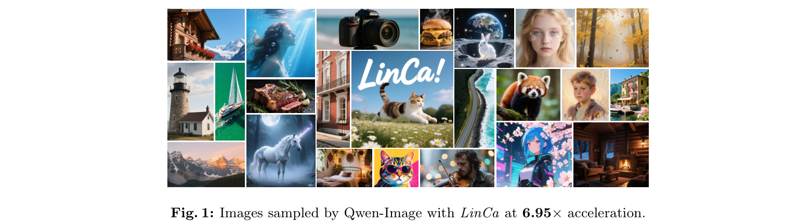
</p>
<p align="center"><em>Fig. 1. Images sampled by Qwen-Image with LinCa at 6.95× acceleration.</em></p>

## News

- **2026-08** — Code, paper, and released predictor weights are public. FLUX / Qwen-Image / Qwen-Image-Edit weights are on [Hugging Face](https://huggingface.co/QHRQQQ/LinCa).

## Highlights

| Setting | Speedup (FLOPs) | Quality | vs. original 50-step |
|---|---:|---|---|
| **FLUX.1-dev** `N=6` | **4.52×** | ImageReward **1.0228** | **+3.0%** (orig. 0.9930) |
| **FLUX.1-dev** `N=8` | **5.51×** | ImageReward **1.0162** | **+2.3%** |
| **Qwen-Image** `N=10` | **6.95×** | ImageReward **1.0524** · CLIP **35.17** | best among cache methods |
| **HunyuanVideo** `N=6` | **5.50×** | VBench **80.16** | **−0.6%** (orig. 80.66) |
| **Qwen-Image-Edit** `N=7` | **5.52×** | GEdit-EN OS **7.56** | matches / exceeds original |
| **Wan2.1-1.3B** `N=6` | **5.00×** | VBench **82.56** | beats TaylorSeer 81.07 @ 4.17× |

Also works on **FLUX.1-lite-8B**, **FLUX.1-schnell**, **FLUX.1-dev-int8**, and **Qwen-Image-Lightning**. Predictors train from 100–200 cached features in about **one hour on a single 12 GB GPU**, without loading the backbone.

## Why existing caches break

Training-free caches apply **one** prediction rule to every model, every timestep, and every feature dimension. Continuity is not uniform: some dimensions jump, some are smooth, and the mix changes across models and denoising stages.

<p align="center">
  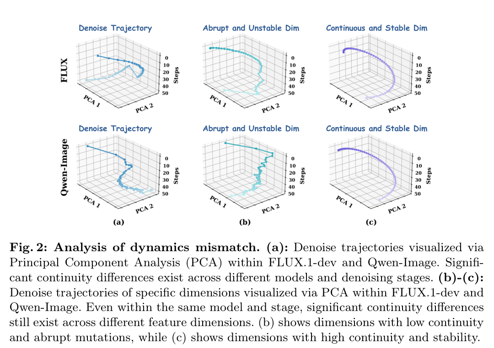
</p>
<p align="center"><em>Fig. 2. Dynamics mismatch across models, stages, and dimensions. (b) unstable dimensions; (c) stable dimensions.</em></p>

## Method

LinCa is a **Decompose → Predict → Reconstruct** pipeline:

1. **Decompose** — a learnable invertible network maps a cached DiT feature into partitions with different continuity.
2. **Predict** — order 0 reuses the last cache; higher-order partitions use matching polynomial prediction.
3. **Reconstruct** — the inverse mapping returns the predicted feature. Each block is an invertible 1×1 convolution plus an additive coupling layer, so \(\mathcal{E}_\theta^{-1}\circ\mathcal{E}_\theta = I\).

Separate predictors can be trained for different models and timestep segments.

<p align="center">
  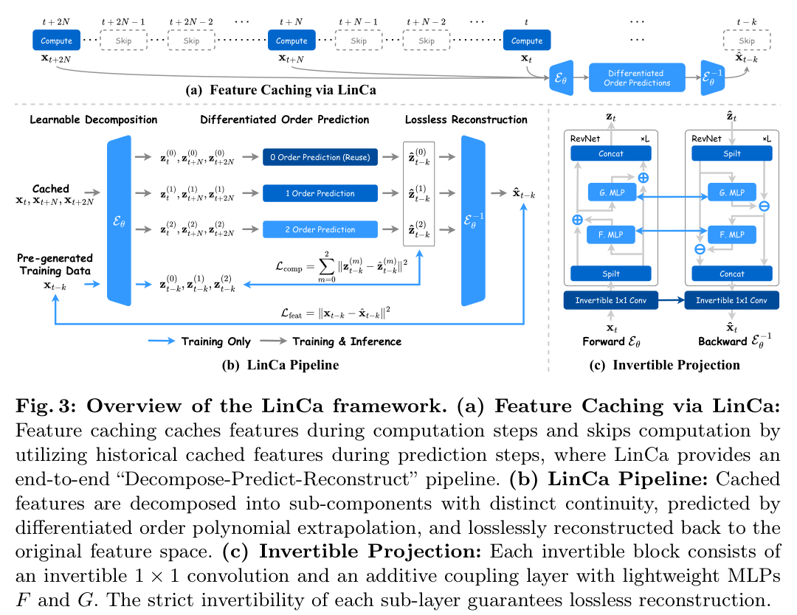
</p>
<p align="center"><em>Fig. 3. Overview of LinCa: feature caching, the decompose–predict–reconstruct pipeline, and the invertible block.</em></p>

## Qualitative results

On **FLUX.1-dev**, LinCa is faster and keeps text, small details, and spatial relations that other caches drop.

<p align="center">
  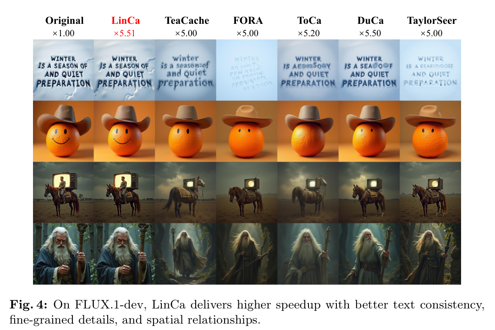
</p>

On **Qwen-Image**, quality holds as the acceleration ratio grows; TaylorSeer blurs and loses detail.

<p align="center">
  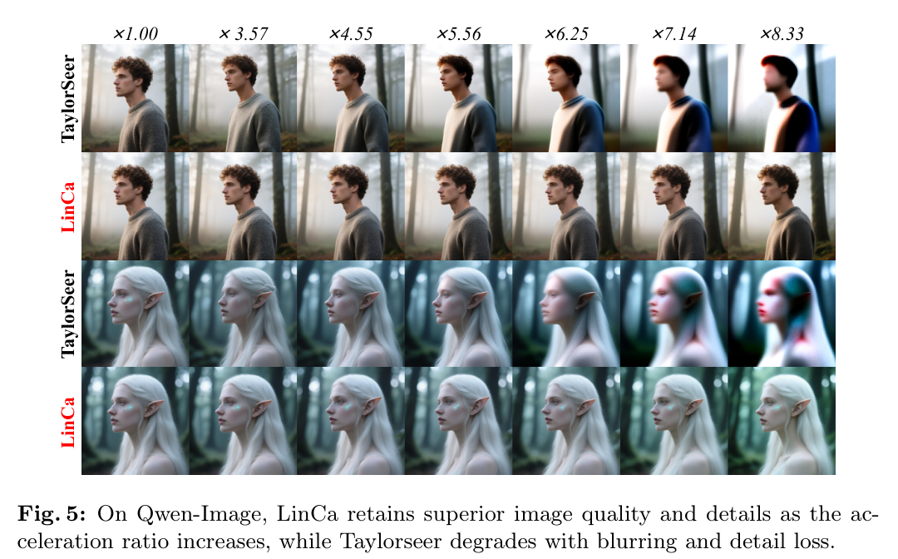
</p>

On **HunyuanVideo**, LinCa keeps background, layout, and motion that 22%-steps / TaylorSeer / TeaCache lose — at a higher speedup.

<p align="center">
  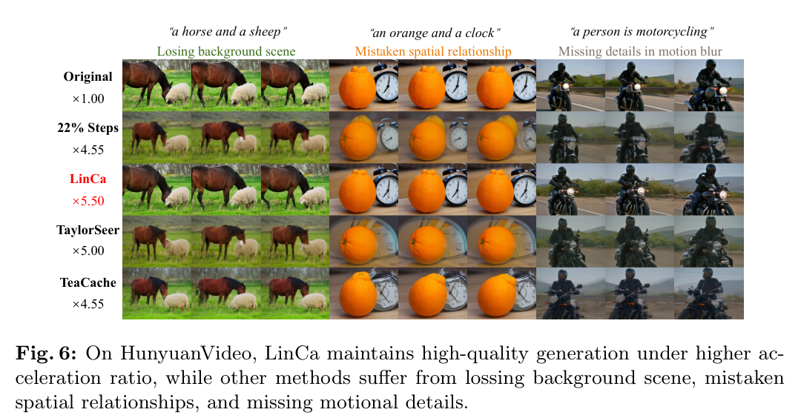
</p>

On **Qwen-Image-Edit**, instruction following stays sharp and unedited regions stay consistent.

<p align="center">
  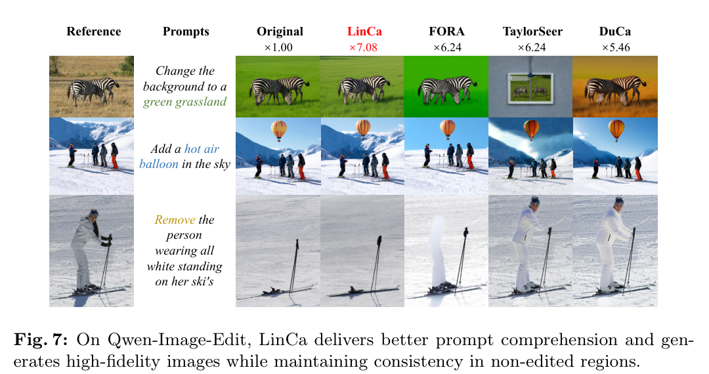
</p>

## Quantitative results

All tables below are cropped from the paper PDF.

### FLUX.1-dev

LinCa is best on the speed–quality curve at `N=4 / 6 / 8`. At `N=6` it is **4.52×** faster in FLOPs with ImageReward **1.0228 (+3.0%)**. TeaCache / DBCache collapse under similar budgets.

<p align="center">
  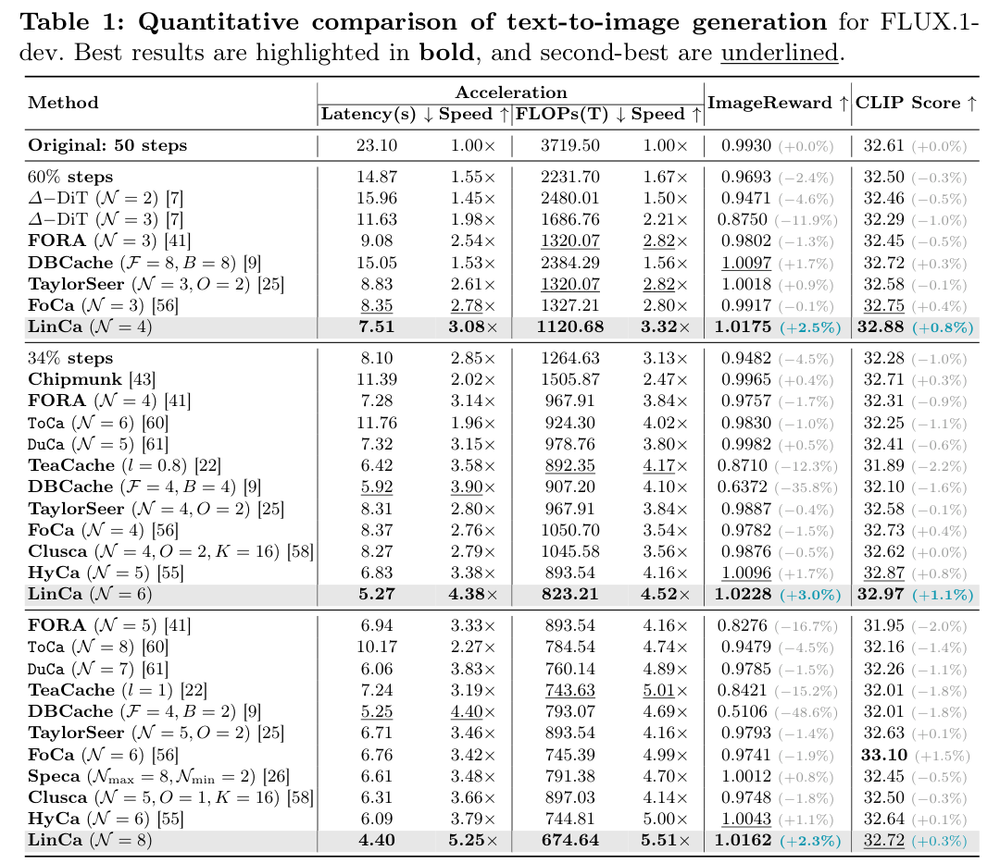
</p>

### Qwen-Image

At `N=10` LinCa reaches **6.95×** FLOPs speedup with the best ImageReward / CLIP / PSNR / SSIM / LPIPS among cache methods. FORA / ToCa / DuCa / TaylorSeer drop sharply at this ratio.

<p align="center">
  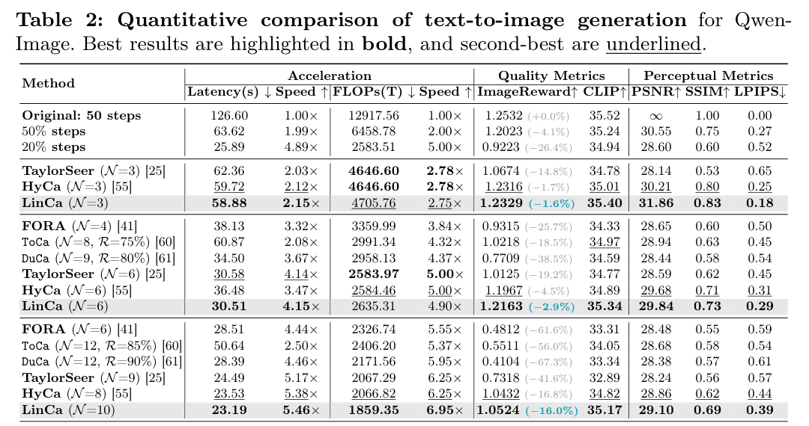
</p>

### HunyuanVideo

`N=6` → **5.50×** FLOPs, VBench **80.16** (original 80.66). Ahead of FORA, ToCa, DuCa, TeaCache, TaylorSeer, Speca, Clusca, and FoCa.

<p align="center">
  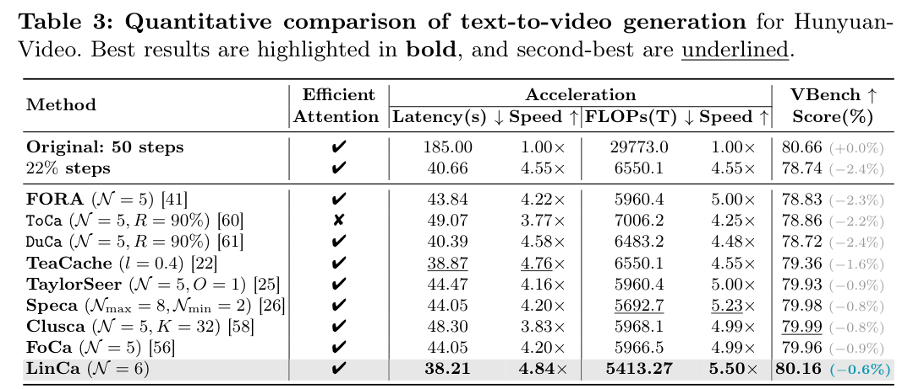
</p>

### Qwen-Image-Edit (GEdit-Bench)

`N=7` → **5.52×** FLOPs, GEdit-EN OS **7.56** (original 7.54). `N=10` → **7.08×** FLOPs, OS **7.40**, while DuCa / TaylorSeer fall to ~6.3.

<p align="center">
  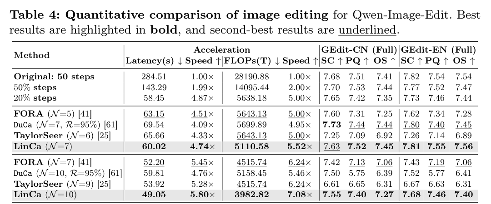
</p>

### Distilled and quantized FLUX

LinCa stacks with model distillation, step distillation, and INT8:

| Backbone | Steps | Speedup (FLOPs) | ImageReward | CLIP |
|---|---:|---:|---:|---:|
| FLUX.1-lite-8B | 28 → LinCa `N=3` | **2.32×** | 0.8936 → **0.9070** | 32.12 → **32.36** |
| FLUX.1-schnell | 4 → LinCa `N=3` | **1.99×** | 0.9692 → **0.9843** | 32.54 → **32.67** |
| FLUX.1-dev-int8 | 50 → LinCa `N=3` | **2.63×** | 0.9744 → **1.0036** | 32.55 → **32.81** |

<p align="center">
  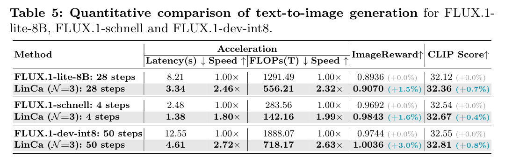
</p>

### Versus distilled models and training-based caches

On FLUX, LinCa at 14 steps (**3.57×**, IR **1.02**) beats FLUX.1-lite-8B (28 steps, 1.79×, IR 0.89), and at 8–10 steps beats LESA at a higher or equal ratio.

<p align="center">
  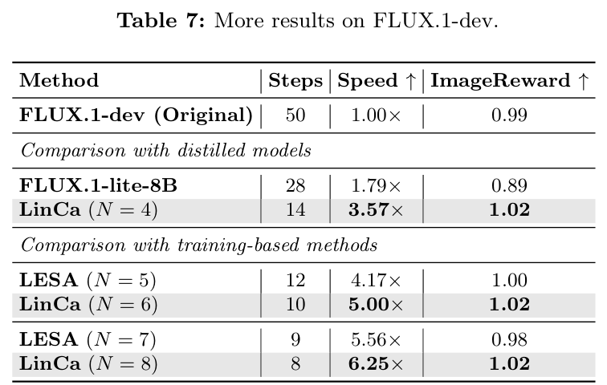
</p>

On Qwen-Image, LinCa at 14 steps (**3.57×**, IR **1.19**) beats Qwen-Image-Distill-Full / LoRA (15 steps, IR 1.02 / 0.95), and stays ahead of LESA at 5.56× and 7.14×.

<p align="center">
  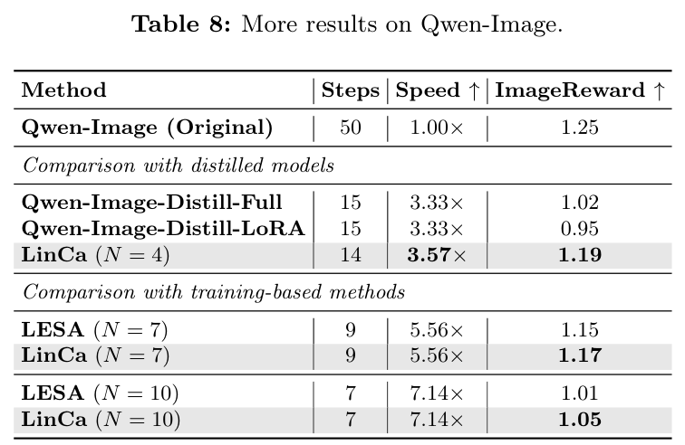
</p>

### Few-step distillation and Wan2.1

Qwen-Image-Lightning (8 steps) + LinCa `N=3` → **2.00×**, ImageReward 1.26 (orig. 1.28), GenEval **0.85** (orig. 0.84).

<p align="center">
  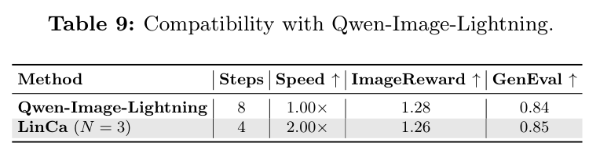
</p>

Wan2.1-1.3B: LinCa `N=6` → **5.00×**, VBench **82.56** vs TaylorSeer 81.07 at 4.17×.

<p align="center">
  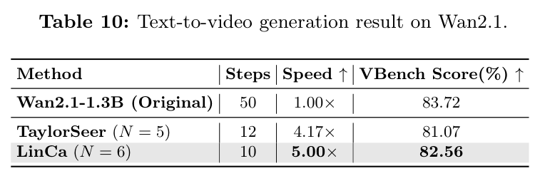
</p>

## Analysis

### Ablation

A trained invertible network beats both an MLP and an untrained invertible net on FLUX and Qwen-Image. Differentiated orders `0+1+2` stay ahead of any single order as `N` grows.

<p align="center">
  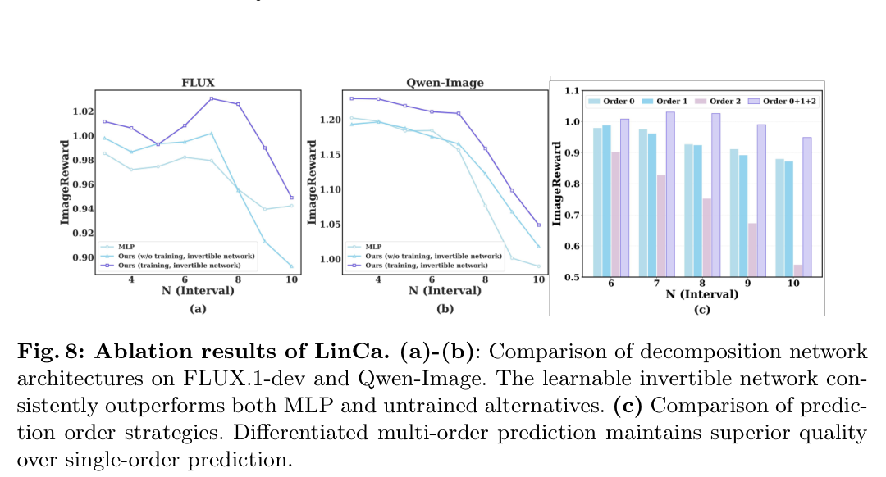
</p>

### Prediction error

LinCa keeps feature MSE low as the cache interval grows. FORA rises steadily; TaylorSeer blows up after `N=6`.

<p align="center">
  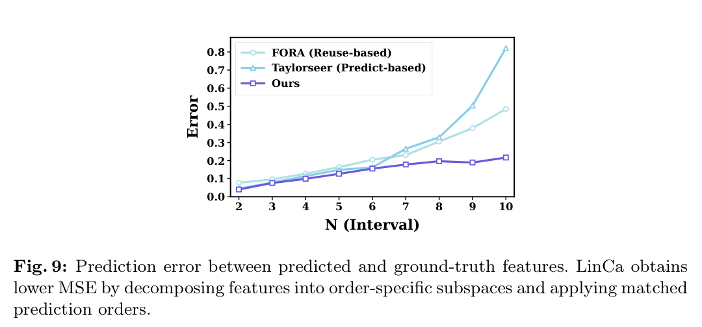
</p>

### Hyperparameters

Paper sweep: timestep segments `S=3`, loss weight `λ=1`, architecture `L=2`, `h=128` are strongest. Extra segments past 3 help little; too-small or too-large `λ` hurts.

<p align="center">
  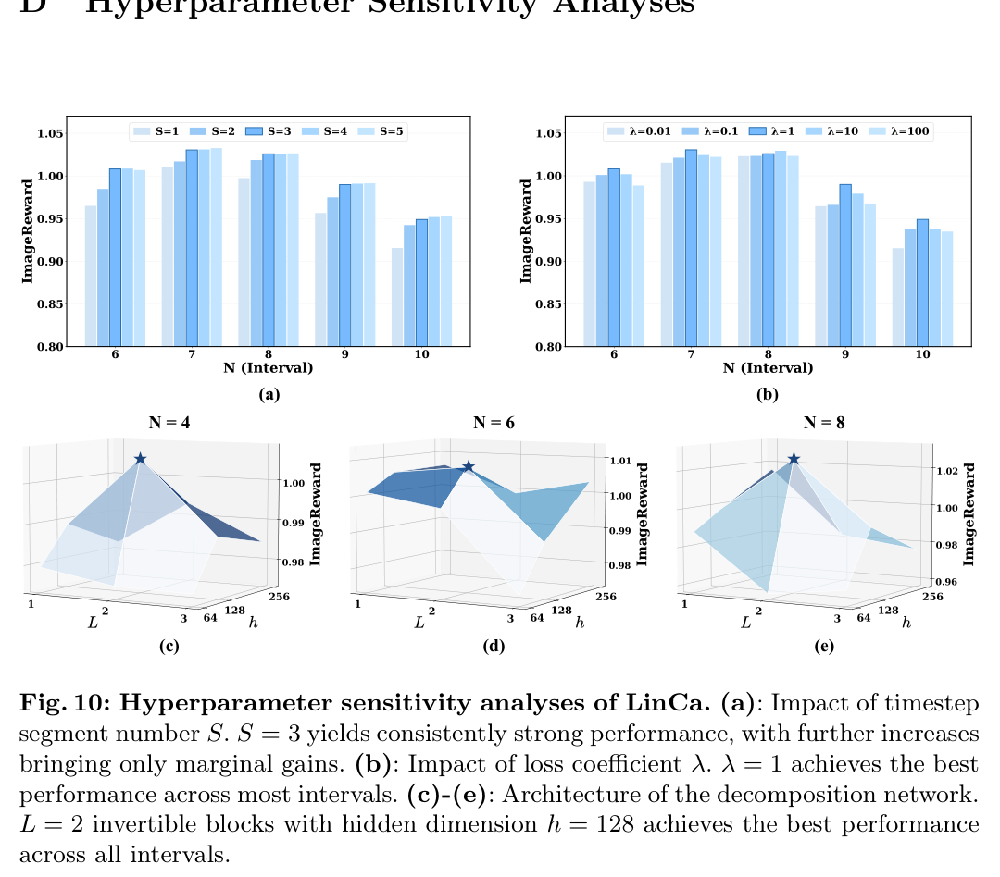
</p>

### High-order predictor

At the same **5.51×**, Hermite is best (IR **1.0162**, CLIP **32.72**), ahead of Lagrange / Taylor / Chebyshev / Laguerre. Uniform Taylor on the full feature (TaylorSeer) is weaker even at 4.16×.

<p align="center">
  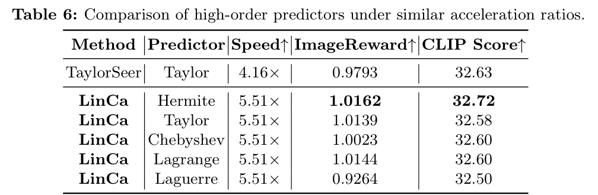
</p>

Released inference scripts keep the **code defaults that match the published checkpoints**. Do not change those defaults just to copy the paper sweep.

## Supported models

| Model | Code | Released weights | Notes |
|---|---|---|---|
| FLUX.1-dev | [`models/flux`](models/flux) | 3-stage predictors | Inference with released weights |
| Qwen-Image | [`models/qwen_image`](models/qwen_image) | two-stage checkpoint | Defaults match the released file |
| Qwen-Image-Edit | [`models/qwen_image_edit`](models/qwen_image_edit) | two-stage checkpoint | Defaults match the released file |
| HunyuanVideo | [`models/hunyuanvideo`](models/hunyuanvideo) | — | Train your own predictor |
| Wan2.1 | [`models/wan2.1`](models/wan2.1) | — | Train your own predictor |

Predictor weights: [QHRQQQ/LinCa](https://huggingface.co/QHRQQQ/LinCa). Backbone weights are **not** included — get them from the official FLUX / Qwen / HunyuanVideo / Wan sources.

## Quick start

Install the official stack for the backbone, then load the LinCa predictor. More flags: [`docs/inference.md`](docs/inference.md).

### Qwen-Image

```bash
huggingface-cli download QHRQQQ/LinCa qwen-image_checkpoint.pt --local-dir ./checkpoints

cd models/qwen_image/qwen_image_linca_two_stage
python sample_learned.py \
  --checkpoint ../../../checkpoints/qwen-image_checkpoint.pt \
  --prompt_file prompts/DrawBench200.txt \
  --output_dir samples/qwen_image
```

### Qwen-Image-Edit

```bash
huggingface-cli download QHRQQQ/LinCa qwen-image-edit_checkpoint.pt --local-dir ./checkpoints

cd models/qwen_image_edit/qwen_image_edit_linca_two_stage
python sample_edit_single.py \
  --checkpoint ../../../checkpoints/qwen-image-edit_checkpoint.pt \
  --image path/to/input.png \
  --prompt "your edit instruction"
```

### FLUX.1-dev

```bash
huggingface-cli download QHRQQQ/LinCa \
  flux/best_predictor_stage0.pt \
  flux/best_predictor_stage1.pt \
  flux/best_predictor_stage2.pt \
  --local-dir ./checkpoints

export FLUX_CHECKPOINT_DIR=/path/to/FLUX.1-dev
cd models/flux
bash run_sample.sh ../../checkpoints/flux 17,17,16
```

`run_sample.sh` expects official FLUX.1-dev files (`flux1-dev.safetensors` + `ae.safetensors`) via `FLUX_CHECKPOINT_DIR` / `FLUX_MODEL` / `FLUX_AE`. Stage splits `17,17,16` match a 50-step schedule.

### HunyuanVideo / Wan2.1

Sampling and training scripts are in each folder. We do not publish trained predictors for these two models.

## Training

Qwen-Image, Qwen-Image-Edit, HunyuanVideo, and Wan2.1 include cache-feature generation and training scripts. Typical recipe from the paper:

1. Generate intermediate features on a small prompt set (about 100–200 images).
2. Train one invertible predictor per timestep segment.
3. Plug the checkpoint into the sample script.

FLUX training code is not part of this release. See each model README for the exact commands.

## Repository layout

```
LinCa/
├── models/flux                 # FLUX inference
├── models/qwen_image           # Qwen-Image train + sample
├── models/qwen_image_edit      # Qwen-Image-Edit train + sample
├── models/hunyuanvideo         # HunyuanVideo train + sample
├── models/wan2.1               # Wan2.1 train + sample
├── docs/                       # extra notes
└── assets/                     # figures and tables from the paper PDF
```

## Citation

```bibtex
@article{liu2026linca,
  title={LinCa: Accelerating Diffusion Models via Learnable Decomposed Feature Caching},
  author={Liu, Jinshan and Qin, Haoran and Tu, Xiaobing and Liu, Jiacheng and Hu, Jiahui and Yan, Zhengan and Xie, Yukun and Shen, Kerui and Ren, Jinkui and Lin, Yuqi and Zhang, Xiantao and Zhang, Linfeng},
  journal={arXiv preprint arXiv:2608.17973},
  year={2026}
}
```

## License

LinCa code is [Apache-2.0](LICENSE). Upstream backbones keep their own licenses; see [NOTICE](NOTICE).

Contact: [qinhaoran68@gmail.com](mailto:qinhaoran68@gmail.com)
